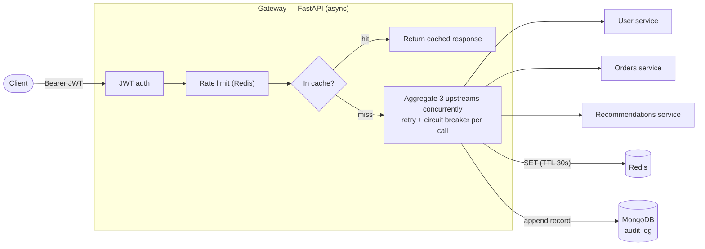
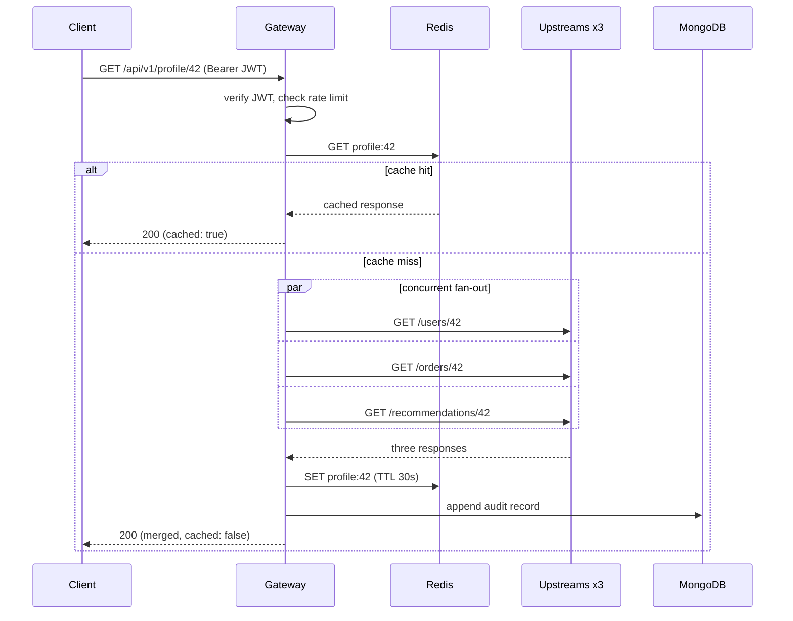
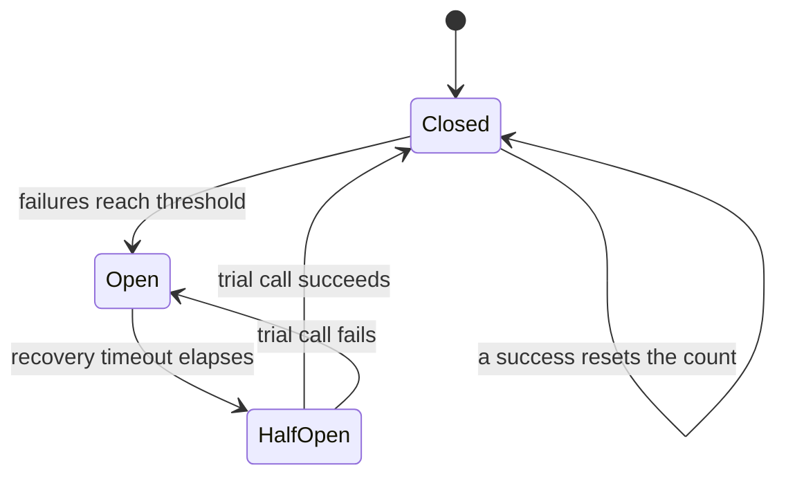
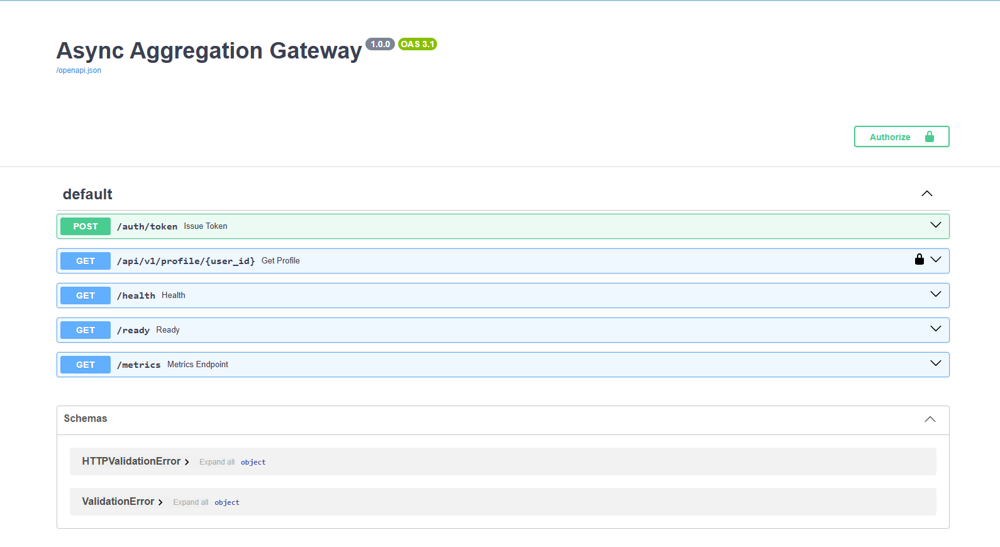

# Async Aggregation Gateway


A REST gateway that fans out to three upstream services **concurrently**, merges
their responses, and adds the operational plumbing a real service needs: caching,
JWT auth, rate limiting, resilience (retry + circuit breaker), structured logging,
health checks, containers, and CI.

Built with FastAPI (async Python), Redis, and MongoDB.

## Architecture



## What it does

`GET /api/v1/profile/{user_id}` calls a user service, an orders service, and a
recommendations service **at the same time** (`asyncio.gather`), then returns one
combined document. Each upstream call is protected so a slow or broken dependency
can't take the whole gateway down.

## Request flow



## Features

| Area | What's implemented |
|---|---|
| Concurrency | Three upstreams fetched together with `asyncio.gather` over a pooled `httpx` client |
| Caching | Full responses cached in Redis with a short TTL |
| Auth | JWT bearer tokens (`/auth/token` issues, endpoints verify) |
| Rate limiting | Fixed-window limit per user, backed by Redis |
| Resilience | Retry with exponential backoff + a per-upstream circuit breaker |
| Graceful degradation | If one upstream is down, its section is marked unavailable and the rest is still served |
| Audit log | Every request appended to a MongoDB collection |
| Observability | JSON logs, a correlation ID per request, `/health`, `/ready`, `/metrics` |
| Delivery | Dockerfile, docker-compose, and a GitHub Actions pipeline running the tests |

## Resilience: the circuit breaker

Each upstream has its own breaker — a switch with three positions. It stops one
broken dependency from tying up the gateway with slow, doomed calls.



- **Closed** — normal. Calls pass through; consecutive failures are counted.
- **Open** — tripped. Calls are rejected instantly for a cooldown, so we stop hammering a service that's clearly down.
- **Half-open** — after the cooldown, one trial call is allowed. Success closes the breaker; failure re-opens it.

Alongside it, **retry with exponential backoff**: if a call fails, wait and try
again, doubling the wait each time (0.2s, 0.4s, 0.8s…) up to a cap, with a little
random jitter so many clients don't retry in lockstep.

## Endpoints

| Method | Path | Notes |
|---|---|---|
| POST | `/auth/token` | body `{"username","password"}` → JWT |
| GET | `/api/v1/profile/{user_id}` | requires `Authorization: Bearer <token>`; rate limited |
| GET | `/health` | liveness — is the process up |
| GET | `/ready` | readiness — are Redis and Mongo reachable |
| GET | `/metrics` | Prometheus-format counters |

## Live API

Interactive docs are served at `/docs` (Swagger UI), generated from the code:



## Run it locally (Docker — everything included)

Brings up the gateway, a mock upstream, Redis, and Mongo. No external services
needed.

```bash
docker compose up --build
```

Then open **http://localhost:8000/docs** and:

1. POST `/auth/token` with `{"username":"demo","password":"demo-password"}`, copy the `access_token`.
2. Click **Authorize** (top right), paste the token.
3. GET `/api/v1/profile/42` → you get the three upstreams merged into one response.

To see the cache hit, call `/api/v1/profile/42` twice within 30 seconds — the
second response shows `"cached": true`. Check `/metrics` to watch the counters
move.

## Run it locally (without Docker)

```bash
python -m venv .venv && source .venv/bin/activate
pip install -r requirements.txt

# start Redis and Mongo yourself (e.g. via docker), then:
uvicorn upstreams.mock_upstream:app --port 9001 &   # the three fake backends
cp .env.example .env
uvicorn app.main:app --reload --port 8000
```

## Tests

```bash
# fast unit tests — no services needed (circuit breaker, backoff, rate limit, JWT)
pytest -m "not integration"

# full suite including the end-to-end flow — needs Redis + Mongo running
pytest
```

CI (`.github/workflows/ci.yml`) spins up Redis and Mongo as service containers and
runs the whole suite on every push.

## Project layout

```
app/
  main.py            FastAPI app, routes, auth, health/ready/metrics
  aggregator.py      concurrent fetch + merge + graceful degradation
  clients.py         Redis / Mongo / httpx setup
  config.py          settings from environment
  observability.py   JSON logging, correlation IDs, metrics
  core/
    circuit_breaker.py   3-state breaker (closed / open / half-open)
    retry.py             exponential backoff
    rate_limit.py        fixed-window limiter (in-memory + Redis)
    security.py          JWT create / verify
upstreams/mock_upstream.py   three fake backends for local dev
tests/                       unit + integration tests
docs/                        screenshots
```

## Notes

- The mock upstream stands in for real services during local dev; in production
  the `*_SERVICE_URL` settings point at the real endpoints.
- The demo credentials (`demo` / `demo-password`) and `JWT_SECRET` are for local
  use only — set real values via environment variables before deploying anywhere.
